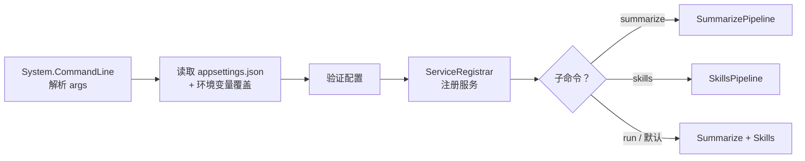
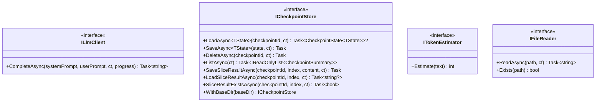
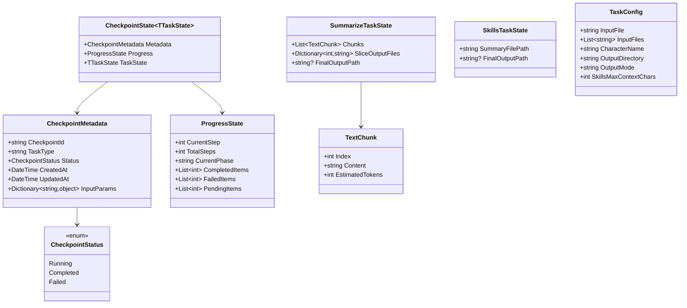
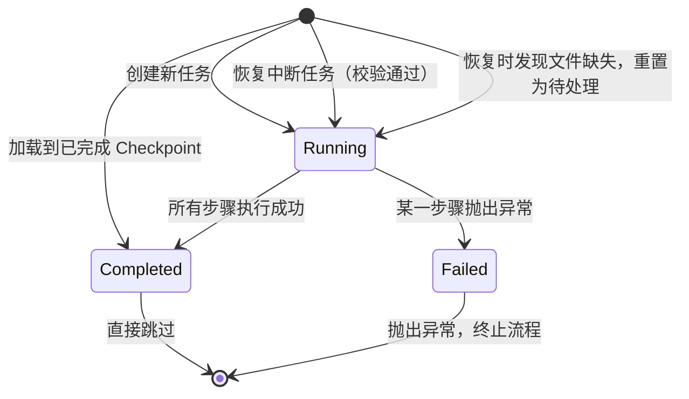
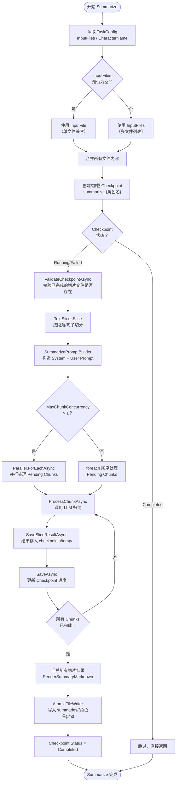
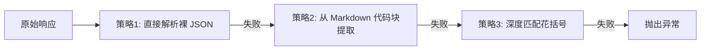
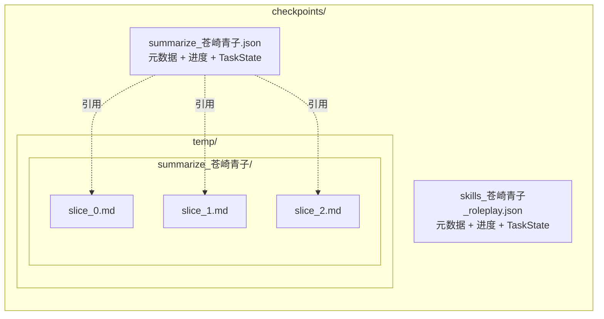
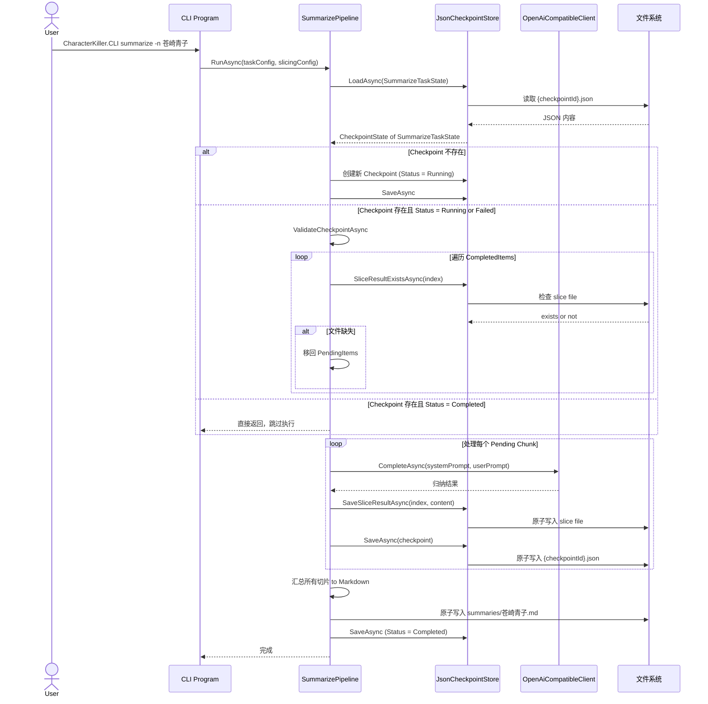
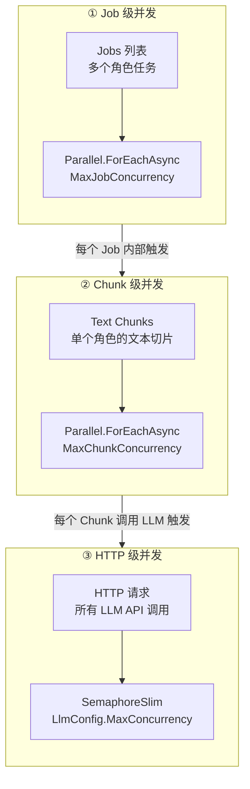

# CharacterKiller 架构文档

> 本文档描述 CharacterKiller 的代码架构、核心类关系与数据流程。
> 所有图示使用 [Mermaid](https://mermaid.js.org/) 语法，可直接在支持 Mermaid 的 Markdown 阅读器中渲染。

---

## 阅读指南

| 章节 | 适合读者 | 内容 |
|------|---------|------|
| [1. 架构概览](#1-架构概览) | 所有人 | 项目分层、依赖关系，5 分钟快速了解全貌 |
| [2. 分层详解](#2-分层详解) | 需要深入了解某一层的人 | 每一层的职责、关键类、代码入口 |
| [3. 核心抽象](#3-核心抽象) | 要扩展功能的人 | 4 个核心接口的设计意图和使用方式 |
| [4. 数据模型](#4-数据模型) | 需要理解数据结构的人 | Checkpoint、TaskState、Config 等模型的关系 |
| [5. Pipeline 数据流](#5-pipeline-数据流) | 要调试或修改流水线的人 | Summarize 和 Skills 的完整执行流程 |
| [6. Checkpoint 机制](#6-checkpoint-断点续传机制) | 关心可靠性的人 | 存储结构、恢复时序、校验逻辑 |
| [7. 并发控制](#7-并发控制模型) | 需要调优性能的人 | 三层并发架构及配置方式 |
| [8. 设计决策](#8-关键设计决策) | 想理解架构取舍的人 | 每个重要决策的 Why |

---

## 1. 架构概览

### 1.1 设计原则

CharacterKiller 采用**严格向内依赖的分层架构**（Onion Architecture 的简化版）：

- **Core** 层不依赖任何其他项目，只包含领域模型、接口和纯逻辑
- **Application** 层编排业务流水线，只依赖 Core
- **Infrastructure** 层实现具体技术（HTTP、文件系统），只依赖 Core
- **CLI** 层作为可执行入口，组合 Application + Infrastructure，是唯一了解"如何运行"的层

这种设计的核心好处是：**业务逻辑与具体技术解耦**。例如，替换 LLM 提供商、更换存储方式或改变 CLI 框架，都不需要修改 Pipeline 代码。

### 1.2 项目分层表

| 项目 | 职责 | 对外依赖 |
|------|------|---------|
| `CharacterKiller.CLI` | 命令行解析、配置绑定、依赖注册、主流程编排 | Application + Infrastructure |
| `CharacterKiller.Application` | 业务流水线（Pipeline）与 Prompt 构造 | Core |
| `CharacterKiller.Infrastructure` | LLM 客户端、文件存储、Token 估算 | Core |
| `CharacterKiller.Core` | 领域模型、接口、纯逻辑服务 | 无 |

### 1.3 依赖关系图

```mermaid
graph TB
    subgraph CLI["CharacterKiller.CLI"]
        Program["Program.cs"]
        CliConfig["CliConfig"]
        ServiceRegistrar["ServiceRegistrar"]
    end

    subgraph App["CharacterKiller.Application"]
        SummarizePipeline["SummarizePipeline"]
        SkillsPipeline["SkillsPipeline"]
        SummarizePromptBuilder["SummarizePromptBuilder"]
        RoleplayPromptBuilder["RoleplayPromptBuilder"]
        TemplatePromptBuilder["TemplatePromptBuilder"]
    end

    subgraph Infra["CharacterKiller.Infrastructure"]
        OpenAiClient["OpenAiCompatibleClient"]
        LlmClientFactory["LlmClientFactory"]
        JsonCheckpointStore["JsonCheckpointStore"]
        NullCheckpointStore["NullCheckpointStore"]
        LocalFileReader["LocalFileReader"]
        CharBasedEstimator["CharBasedEstimator"]
    end

    subgraph Core["CharacterKiller.Core"]
        subgraph Interfaces["Interfaces"]
            ILlmClient["ILlmClient"]
            ICheckpointStore["ICheckpointStore"]
            ITokenEstimator["ITokenEstimator"]
            IFileReader["IFileReader"]
        end

        subgraph Models["Models"]
            CheckpointState["CheckpointState<TTaskState>"]
            CheckpointMetadata["CheckpointMetadata"]
            ProgressState["ProgressState"]
            TaskConfig["TaskConfig"]
            TextChunk["TextChunk"]
            SummarizeTaskState["SummarizeTaskState"]
            SkillsTaskState["SkillsTaskState"]
        end

        subgraph Services["Services"]
            TextSlicer["TextSlicer"]
            TokenLimiter["TokenLimiter"]
            AtomicFileWriter["AtomicFileWriter"]
        end

        subgraph Resilience["Resilience"]
            RetryPolicy["RetryPolicy"]
        end
    end

    CLI --> App
    CLI --> Infra
    App --> Core
    Infra --> Core

    Program --> CliConfig
    Program --> ServiceRegistrar
    ServiceRegistrar --> SummarizePipeline
    ServiceRegistrar --> SkillsPipeline
    ServiceRegistrar --> OpenAiClient
    ServiceRegistrar --> JsonCheckpointStore
    ServiceRegistrar --> LocalFileReader
    ServiceRegistrar --> CharBasedEstimator

    SummarizePipeline --> ILlmClient
    SummarizePipeline --> ICheckpointStore
    SummarizePipeline --> ITokenEstimator
    SummarizePipeline --> IFileReader
    SummarizePipeline --> TextSlicer
    SummarizePipeline --> SummarizePromptBuilder

    SkillsPipeline --> ILlmClient
    SkillsPipeline --> ICheckpointStore
    SkillsPipeline --> RoleplayPromptBuilder
    SkillsPipeline --> TemplatePromptBuilder

    OpenAiClient -.implements.-> ILlmClient
    JsonCheckpointStore -.implements.-> ICheckpointStore
    NullCheckpointStore -.implements.-> ICheckpointStore
    LocalFileReader -.implements.-> IFileReader
    CharBasedEstimator -.implements.-> ITokenEstimator

    TextSlicer --> ITokenEstimator
    TextSlicer --> TextChunk
    TokenLimiter --> ITokenEstimator
    OpenAiClient --> RetryPolicy
    JsonCheckpointStore --> AtomicFileWriter
```



---

## 2. 分层详解

### 2.1 CLI 层（CharacterKiller.CLI）

**职责**：程序的入口点。解析命令行参数、加载配置、注册依赖、启动 Pipeline。

**关键文件**：

| 文件 | 职责 |
|------|------|
| `Program.cs` | 定义 3 个子命令（`summarize` / `skills` / `run`），编排批量任务并发执行 |
| `Configuration/CliConfig.cs` | 配置根对象，映射 `appsettings.json` 结构 |
| `DependencyInjection/ServiceRegistrar.cs` | 将具体实现（如 `JsonCheckpointStore`、`OpenAiCompatibleClient`）注册到 DI 容器 |

**主流程**：



**配置加载优先级**（由高到低）：

1. 命令行参数（`--input`、`--character`、`--mode`）
2. 环境变量（前缀 `GCS_`，如 `GCS_LLM__MODEL`）
3. `GCS_APIKEY`（单独覆盖 `Llm.ApiKey`）
4. `appsettings.json`

### 2.2 Application 层（CharacterKiller.Application）

**职责**：定义"业务怎么做"。Pipeline 编排数据流向，PromptBuilder 构造发给 LLM 的指令。

**关键文件**：

| 文件 | 职责 |
|------|------|
| `Pipelines/SummarizePipeline.cs` | 读取剧本 → 切片 → 逐段调用 LLM 归纳 → 汇总为 Markdown |
| `Pipelines/SkillsPipeline.cs` | 读取 Summary → 调用 LLM 生成角色 Skill 包（JSON）→ 解析并写入文件夹 |
| `Prompts/SummarizePromptBuilder.cs` | 构造 Summarize 阶段的 System + User Prompt |
| `Prompts/RoleplayPromptBuilder.cs` | 构造 Roleplay 模式的 Skills Prompt |
| `Prompts/TemplatePromptBuilder.cs` | 构造 Template 模式的 Skills Prompt（去剧情化） |

**Pipeline 设计模式**：

两个 Pipeline 都遵循相同的**Checkpoint 驱动模式**：

1. 计算 Checkpoint ID
2. 尝试加载已有 Checkpoint
3. 若已完成则直接跳过
4. 若存在但中断，校验已完成的切片文件是否存在
5. 执行待处理项，每完成一步更新 Checkpoint
6. 标记完成，保存最终输出路径

### 2.3 Infrastructure 层（CharacterKiller.Infrastructure）

**职责**：提供具体技术实现。这一层的类都实现 Core 层定义的接口，可被替换而不影响业务逻辑。

**关键文件**：

| 文件 | 实现接口 | 职责 |
|------|---------|------|
| `Llm/OpenAiCompatibleClient.cs` | `ILlmClient` | 兼容 OpenAI API 格式的 HTTP 客户端，支持 SSE 流式输出 |
| `Llm/LlmClientFactory.cs` | — | 根据 `Provider` 创建对应客户端（目前统一返回 `OpenAiCompatibleClient`） |
| `Storage/JsonCheckpointStore.cs` | `ICheckpointStore` | JSON 文件持久化 Checkpoint，支持大内容分离存储 |
| `Storage/NullCheckpointStore.cs` | `ICheckpointStore` | 空实现，用于禁用 Checkpoint 时 |
| `Storage/LocalFileReader.cs` | `IFileReader` | 本地文件读取，拒绝超过 500 MB 的文件 |
| `Tokenization/CharBasedEstimator.cs` | `ITokenEstimator` | 基于字符数的 Token 近似估算 |

### 2.4 Core 层（CharacterKiller.Core）

**职责**：定义领域语言。包含所有接口、模型、纯逻辑服务。这一层**没有外部依赖**，是项目中最稳定的代码。

**关键文件**：

| 类别 | 文件 | 职责 |
|------|------|------|
| 接口 | `ILlmClient.cs` | LLM 客户端抽象 |
| 接口 | `ICheckpointStore.cs` | Checkpoint 持久化抽象（泛型设计） |
| 接口 | `ITokenEstimator.cs` | Token 估算抽象 |
| 接口 | `IFileReader.cs` | 文件读取抽象 |
| 模型 | `CheckpointState.cs` | 泛型 Checkpoint 容器 |
| 模型 | `ProgressState.cs` | 通用进度状态 |
| 模型 | `SummarizeTaskState.cs` | Summarize 任务特有状态 |
| 模型 | `SkillsTaskState.cs` | Skills 任务特有状态 |
| 模型 | `TaskConfig.cs` / `JobConfig.cs` | 任务配置 |
| 服务 | `TextSlicer.cs` | 按段落/句子切分文本，保持上下文重叠 |
| 服务 | `TokenLimiter.cs` | 二分查找截断文本至指定 token 数 |
| 服务 | `AtomicFileWriter.cs` | 原子文件写入（先写临时文件再 Move） |
| 韧性 | `RetryPolicy.cs` | 指数退避重试策略 |

---

## 3. 核心抽象

### 3.1 接口层设计



#### 为什么 `ILlmClient` 需要 `IProgress<string>`？

`OpenAiCompatibleClient` 内部强制使用 SSE 流式读取。早期版本中，流式 token 直接通过 `Console.Write` 输出到终端，这导致：

- 基础设施层与展示层耦合
- 在 GUI 或 Web 场景中无法复用

修复后，`CompleteAsync` 增加可选的 `IProgress<string>? progress` 参数：

```csharp
// 调用方控制展示方式
var progress = new Progress<string>(token => myGui.AppendText(token));
var result = await _llmClient.CompleteAsync(systemPrompt, userPrompt, ct, progress);

// 不传 progress：保持向后兼容的默认控制台输出（含 spinner）
var result = await _llmClient.CompleteAsync(systemPrompt, userPrompt, ct);
```

#### 为什么 `ICheckpointStore` 使用泛型？

不同 Pipeline 需要保存不同的任务状态：

- `SummarizePipeline` 需要 `SummarizeTaskState`（切片列表、切片结果文件映射）
- `SkillsPipeline` 需要 `SkillsTaskState`（Summary 路径、最终输出路径）

泛型设计使得新增 Pipeline 时**无需修改接口**：

```csharp
Task<CheckpointState<TState>?> LoadAsync<TState>(string checkpointId, CancellationToken ct = default)
    where TState : class, new();
```

---

## 4. 数据模型

### 4.1 模型关系图



### 4.2 Checkpoint 状态机



---

## 5. Pipeline 数据流

### 5.1 SummarizePipeline 流程

从原始剧本文本到角色 Summary Markdown 的完整流程：



**关键实现细节**：

- `ProcessChunkAsync` 被顺序和并发路径**统一调用**。并发路径传入 `progressLock` 对象，内部通过 `lock (progressLock)` 保护 Checkpoint 状态更新；顺序路径不传 lock，避免不必要的同步开销。
- 每个切片的结果是**大内容分离存储**：切片文本存入 `checkpoints/temp/{id}/slice_{index}.md`，Checkpoint JSON 只保存文件名映射。这避免了频繁读写大 JSON 文件。

### 5.2 SkillsPipeline 流程

从 Summary 到角色 Skill 文件夹的完整流程：


**JSON 解析容错（三级 Fallback）**：

`ParseSkillPack` 不直接依赖 LLM "一定"返回合法 JSON，而是实现三级容错：



- **策略1**：直接对完整响应做 `JsonSerializer.Deserialize`
- **策略2**：响应以 `` ``` `` 开头时，寻找首个 `{` 到深度匹配的 `}` 之间的内容（通过状态机正确处理字符串内的转义引号）
- **策略3**：在响应任意位置寻找首个 `{`，然后使用深度计数（考虑字符串上下文）找到配对的 `}`

---

## 6. Checkpoint 断点续传机制

### 6.1 存储结构



| 存储位置 | 内容 | 设计原因 |
|---------|------|---------|
| `{checkpointId}.json` | 元数据 + `ProgressState` + `TaskState` | 体积小，频繁读写 |
| `temp/{checkpointId}/slice_{index}.md` | 切片归纳结果（大文本） | 避免 JSON 膨胀，独立管理生命周期 |

### 6.2 断点恢复时序



### 6.3 校验与容错

恢复时，`ValidateCheckpointAsync` 会检查 `CompletedItems` 中每个索引对应的切片文件是否真实存在且有内容。若文件缺失（例如用户手动删除），该索引会被移回 `PendingItems`，重新执行。这确保了**即使磁盘状态与 Checkpoint 元数据不一致，也不会丢失工作**。

---

## 7. 并发控制模型

CharacterKiller 在三个层面独立控制并发：



| 层级 | 控制点 | 配置项 | 默认值 | 说明 |
|------|--------|--------|--------|------|
| Job | `Program.RunJobsAsync` | `ExecutionConfig.MaxJobConcurrency` | `1` | 批量任务间并行 |
| Chunk | `SummarizePipeline.RunAsync` | `ExecutionConfig.MaxChunkConcurrency` | `1` | 单个角色的切片间并行 |
| HTTP | `OpenAiCompatibleClient` | `LlmConfig.MaxConcurrency` | `1` | 全局 LLM API 并发上限 |

三层独立配置，可灵活组合。例如：`MaxJobConcurrency=2`、`MaxChunkConcurrency=4`、`MaxConcurrency=8` 表示同时处理 2 个角色，每个角色 4 个切片并行，总共最多 8 个 HTTP 请求。

---

## 8. 关键设计决策

### 8.1 为什么切片结果与元数据分离存储？

| 存储位置 | 内容 | 原因 |
|---------|------|------|
| `{checkpointId}.json` | 元数据 + `ProgressState` + `TaskState` | 体积小（通常 < 10 KB），频繁读写 |
| `temp/{checkpointId}/slice_{index}.md` | 切片归纳结果（大文本，每片可达数十 KB） | 避免 JSON 膨胀至数 MB，独立管理生命周期 |

如果将所有内容塞进一个 JSON，每次更新进度都要序列化/反序列化数 MB 数据，IO 开销巨大。

### 8.2 为什么强制 SSE 流式输出？

`OpenAiCompatibleClient` 中 `Stream = true` 是硬编码的：

- **用户体验**：长文本生成时实时看到输出，避免"黑屏等待"
- **首 token 感知**：`RunSpinnerAsync` 在首 token 到达前显示旋转进度条；若传入 `IProgress<string>`，调用方可自行实现进度展示
- **超时检测**：流式连接可以更早发现网络/服务异常

### 8.3 为什么默认使用字符近似估算 Token？

项目引用了 `Microsoft.ML.Tokenizers`，但默认注册的是 `CharBasedEstimator`：

- 对 Galgame 中文文本足够精确（1 中文字符 ≈ 1 token）
- 无需加载 Tiktoken 词表，启动更快、内存更小
- 如需精确估算，只需在 `ServiceRegistrar` 中替换为 `TiktokenEstimator`

### 8.4 原子写入的实现

```csharp
// AtomicFileWriter.cs
var tempPath = path + ".tmp" + Guid.NewGuid().ToString("N")[..8];
await File.WriteAllTextAsync(tempPath, content, ct);
File.Move(tempPath, path, overwrite: true);
```

所有关键文件（Checkpoint JSON、Summary Markdown、Skill 文件）均通过原子写入，避免程序崩溃时留下半写文件。

### 8.5 为什么 `ApplyTaskOverrides` 直接修改配置对象？

`ApplyTaskOverrides` 将命令行参数覆盖到 `config.Task` 上，属于**副作用**。在 CLI 场景中这是可接受的——配置对象本身就是单次执行的生命周期，不会被复用。如果未来需要支持"同进程多次执行不同任务"，可以改为返回新的 `TaskConfig` 副本。

---

## 9. 项目目录结构

```
CharacterKiller/
├── CharacterKiller.Core/                  # 领域模型、接口、纯逻辑
│   └── src/
│       ├── Interfaces/
│       │   ├── ICheckpointStore.cs
│       │   ├── IFileReader.cs
│       │   ├── ILlmClient.cs
│       │   └── ITokenEstimator.cs
│       ├── Models/
│       │   ├── CheckpointConfig.cs
│       │   ├── CheckpointMetadata.cs
│       │   ├── CheckpointState.cs
│       │   ├── CheckpointStatus.cs
│       │   ├── CheckpointSummary.cs
│       │   ├── ExecutionConfig.cs
│       │   ├── JobConfig.cs
│       │   ├── LlmConfig.cs
│       │   ├── LlmMessage.cs
│       │   ├── ProgressState.cs
│       │   ├── SkillsTaskState.cs
│       │   ├── SlicingConfig.cs
│       │   ├── SummarizeTaskState.cs
│       │   ├── TaskConfig.cs
│       │   └── TextChunk.cs
│       ├── Resilience/
│       │   └── RetryPolicy.cs
│       └── Services/
│           ├── AtomicFileWriter.cs
│           ├── TextSlicer.cs
│           └── TokenLimiter.cs
│
├── CharacterKiller.Application/           # 业务流水线与 Prompt 构造
│   └── src/
│       ├── Pipelines/
│       │   ├── SkillsPipeline.cs
│       │   └── SummarizePipeline.cs
│       └── Prompts/
│           ├── RoleplayPromptBuilder.cs
│           ├── SummarizePromptBuilder.cs
│           └── TemplatePromptBuilder.cs
│
├── CharacterKiller.Infrastructure/        # 具体技术实现
│   └── src/
│       ├── Llm/
│       │   ├── LlmClientFactory.cs
│       │   └── OpenAiCompatibleClient.cs
│       ├── Storage/
│       │   ├── JsonCheckpointStore.cs
│       │   ├── LocalFileReader.cs
│       │   └── NullCheckpointStore.cs
│       └── Tokenization/
│           └── CharBasedEstimator.cs
│
├── CharacterKiller.CLI/                   # 可执行入口
│   └── src/
│       ├── Configuration/
│       │   └── CliConfig.cs
│       ├── DependencyInjection/
│       │   └── ServiceRegistrar.cs
│       └── Program.cs
│
├── Tools/
│   ├── build.ps1                          # Windows 构建脚本
│   └── build.sh                           # Linux/macOS 构建脚本
│
├── README.md
└── ARCHITECTURE.md                        # 本文档
```
