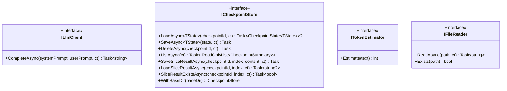
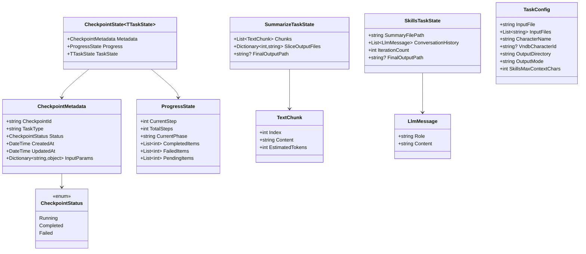
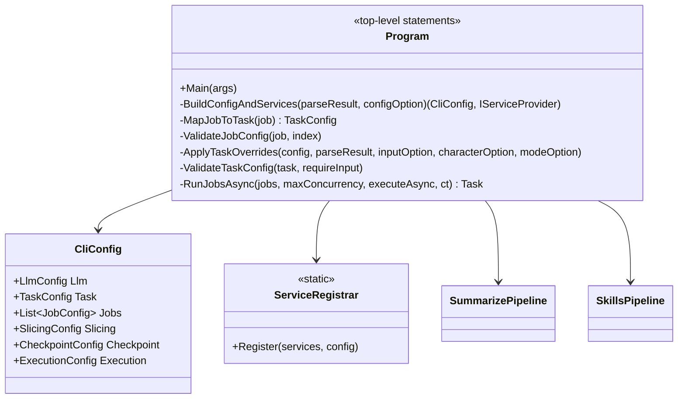
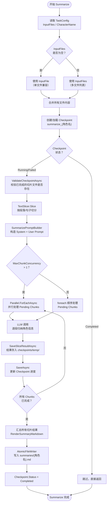
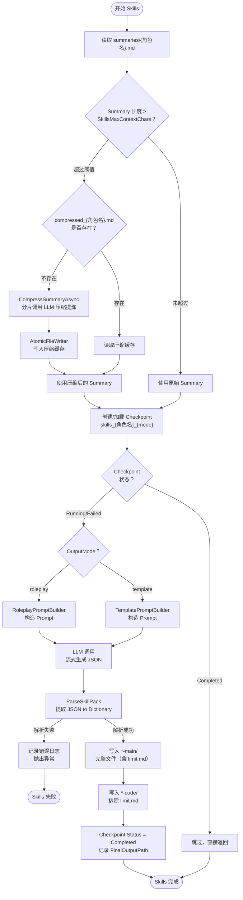
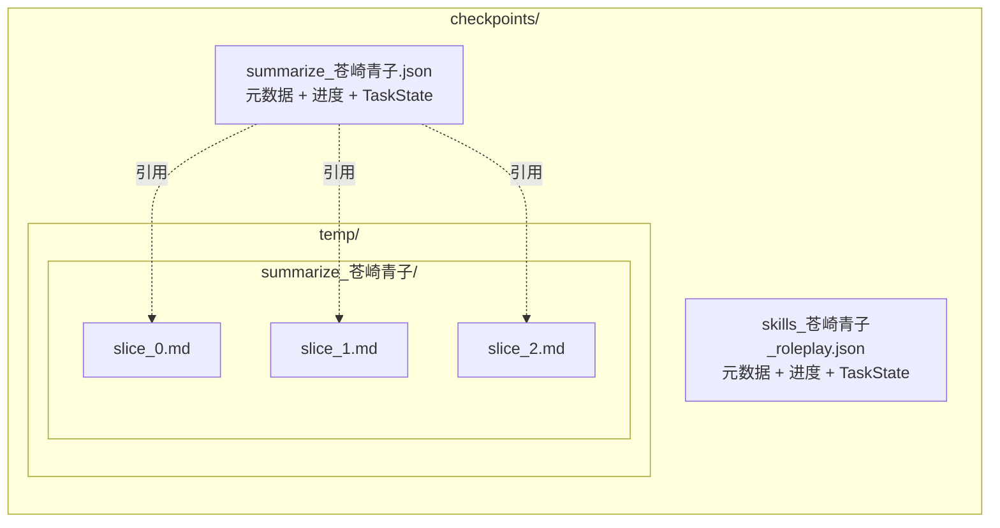
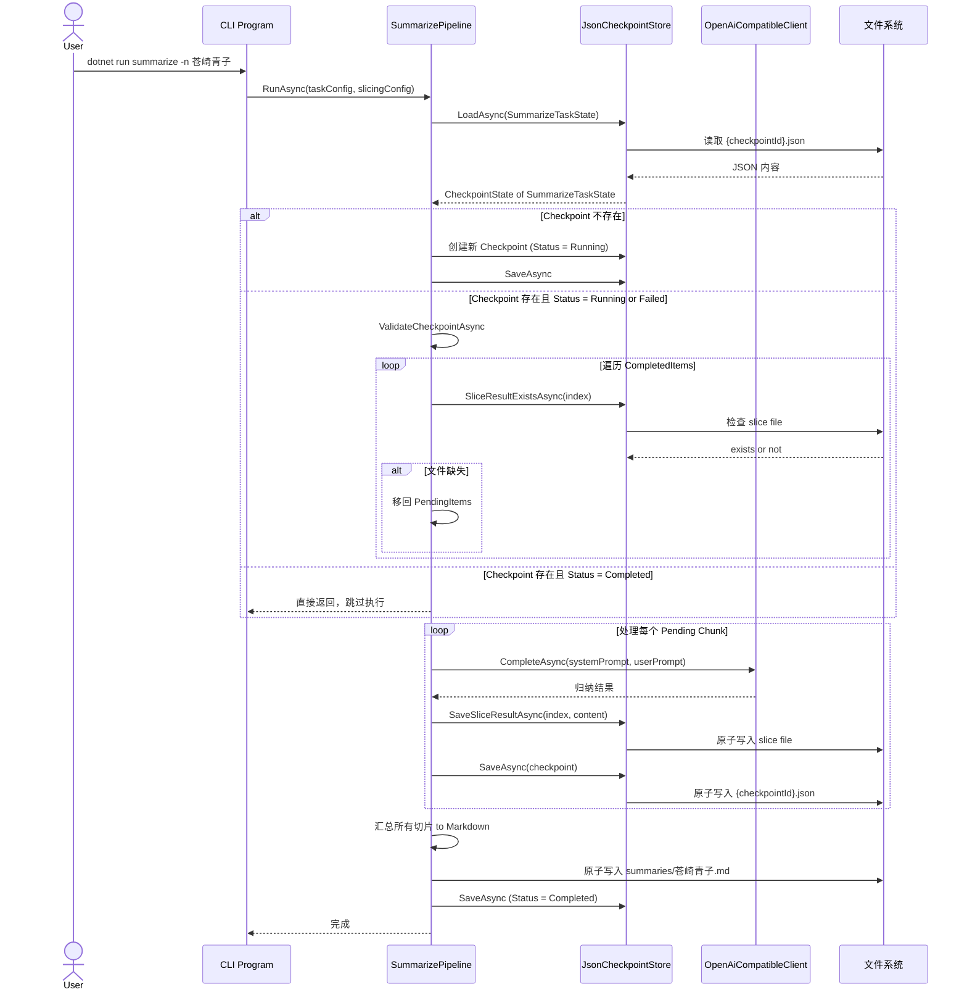
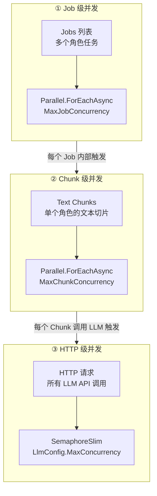

# CharacterKiller 架构文档

> 本文档描述 CharacterKiller 的代码架构、核心类关系与数据流程。
> 所有图示使用 [Mermaid](https://mermaid.js.org/) 语法。

---

## 1. 架构概览

CharacterKiller 采用**分层架构**，共 4 个项目，依赖关系严格向内：

| 项目             | 职责                                           | 依赖                             |
| ---------------- | ---------------------------------------------- | -------------------------------- |
| `Core`           | 领域模型、接口、纯逻辑服务                     | 无                               |
| `Application`    | 业务流水线（Pipeline）与 Prompt 构造           | `Core`                           |
| `Infrastructure` | 具体技术实现：LLM 客户端、文件存储、Token 估算 | `Core`                           |
| `CLI`            | 可执行入口、命令行解析、依赖注册、配置绑定     | `Application` + `Infrastructure` |

---

## 2. 项目依赖图

```mermaid
graph TB
    subgraph CLI["CharacterKiller.CLI"]
        Program["Program.cs<br/>命令行解析 & 主流程编排"]
        CliConfig["CliConfig<br/>配置根节点"]
        ServiceRegistrar["ServiceRegistrar<br/>DI 注册"]
    end

    subgraph Application["CharacterKiller.Application"]
        SummarizePipeline["SummarizePipeline<br/>文本切片归纳流水线"]
        SkillsPipeline["SkillsPipeline<br/>角色技能包生成流水线"]
        SummarizePromptBuilder["SummarizePromptBuilder<br/>Summarize Prompt 构造"]
        RoleplayPromptBuilder["RoleplayPromptBuilder<br/>Roleplay Prompt 构造"]
        TemplatePromptBuilder["TemplatePromptBuilder<br/>Template Prompt 构造"]
    end

    subgraph Infrastructure["CharacterKiller.Infrastructure"]
        OpenAiCompatibleClient["OpenAiCompatibleClient<br/>OpenAI 兼容 LLM 客户端"]
        LlmClientFactory["LlmClientFactory<br/>LLM 客户端工厂"]
        JsonCheckpointStore["JsonCheckpointStore<br/>JSON 断点持久化"]
        NullCheckpointStore["NullCheckpointStore<br/>空实现（禁用断点）"]
        LocalFileReader["LocalFileReader<br/>本地文件读取"]
        CharBasedEstimator["CharBasedEstimator<br/>字符近似 Token 估算"]
    end

    subgraph Core["CharacterKiller.Core"]
        subgraph Interfaces["Interfaces"]
            ILlmClient["ILlmClient"]
            ICheckpointStore["ICheckpointStore&lt;TState&gt;"]
            ITokenEstimator["ITokenEstimator"]
            IFileReader["IFileReader"]
    end

        subgraph Models["Models"]
            CheckpointState["CheckpointState&lt;TTaskState&gt;"]
            CheckpointMetadata["CheckpointMetadata"]
            ProgressState["ProgressState"]
            TaskConfig["TaskConfig"]
            TextChunk["TextChunk"]
            SummarizeTaskState["SummarizeTaskState"]
            SkillsTaskState["SkillsTaskState"]
        end

        subgraph Services["Services & Resilience"]
            TextSlicer["TextSlicer<br/>文本切片"]
            TokenLimiter["TokenLimiter<br/>Token 截断"]
            AtomicFileWriter["AtomicFileWriter<br/>原子文件写入"]
            RetryPolicy["RetryPolicy<br/>指数退避重试"]
        end
    end

    CLI --> Application
    CLI --> Infrastructure
    Application --> Core
    Infrastructure --> Core

    Program --> CliConfig
    Program --> ServiceRegistrar
    ServiceRegistrar --> SummarizePipeline
    ServiceRegistrar --> SkillsPipeline
    ServiceRegistrar --> OpenAiCompatibleClient
    ServiceRegistrar --> JsonCheckpointStore
    ServiceRegistrar --> LocalFileReader
    ServiceRegistrar --> CharBasedEstimator

    SummarizePipeline --> ILlmClient
    SummarizePipeline --> ICheckpointStore
    SummarizePipeline --> ITokenEstimator
    SummarizePipeline --> IFileReader
    SummarizePipeline --> TextSlicer
    SummarizePipeline --> SummarizePromptBuilder
    SummarizePipeline --> AtomicFileWriter

    SkillsPipeline --> ILlmClient
    SkillsPipeline --> ICheckpointStore
    SkillsPipeline --> RoleplayPromptBuilder
    SkillsPipeline --> TemplatePromptBuilder
    SkillsPipeline --> AtomicFileWriter

    OpenAiCompatibleClient -.implements.-> ILlmClient
    JsonCheckpointStore -.implements.-> ICheckpointStore
    NullCheckpointStore -.implements.-> ICheckpointStore
    LocalFileReader -.implements.-> IFileReader
    CharBasedEstimator -.implements.-> ITokenEstimator

    TextSlicer --> ITokenEstimator
    TextSlicer --> TextChunk
    TokenLimiter --> ITokenEstimator
```



---

## 3. 核心类图

### 3.1 接口层



### 3.2 模型层



### 3.3 服务与流水线层

```mermaid
classDiagram
    class AtomicFileWriter {
        <<static>>
        +WriteAllTextAsync(path, content, ct) Task
    }

    class RetryPolicy {
        <<static>>
        +ExecuteAsync~T~(action, maxRetries, canRetry, logger, ct) Task~T~
        +ExecuteAsync(action, maxRetries, canRetry, logger, ct) Task
    }

    class TextSlicer {
        -ITokenEstimator _estimator
        +TextSlicer(estimator)
        +Slice(text, chunkSizeTokens, overlapTokens) List~TextChunk~
        -FlushChunk(...)
        -ExtractOverlap(paragraphs, overlapTokens) string
        -SplitBySentences(paragraph, chunkSizeTokens) List~string~
    }

    class TokenLimiter {
        -ITokenEstimator _estimator
        +TokenLimiter(estimator)
        +TruncateToTokens(text, maxTokens) string
    }

    class SummarizePipeline {
        -ILlmClient _llmClient
        -ITokenEstimator _estimator
        -ICheckpointStore _checkpointStore
        -IFileReader _fileReader
        -ILogger~SummarizePipeline~ _logger
        -ExecutionConfig _executionConfig
        -CheckpointConfig _checkpointConfig
        +RunAsync(taskConfig, slicingConfig, ct) Task
        -ProcessChunkAsync(index, chunks, systemPrompt, checkpoint, checkpointId, store, ct) Task
        -ValidateCheckpointAsync(checkpoint, checkpointId, store, ct) Task
        -RenderSummaryMarkdown(characterName, segments, inputFiles) string
        -Sanitize(name) string
    }

    class SkillsPipeline {
        -ILlmClient _llmClient
        -ICheckpointStore _checkpointStore
        -ILogger~SkillsPipeline~ _logger
        -CheckpointConfig _checkpointConfig
        +RunAsync(taskConfig, ct) Task
        -ParseSkillPack(response) Dictionary~string,string~
        -WriteSkillPackAsync(mainDir, codeDir, files, logPrefix, ct) Task
        -CompressSummaryAsync(characterName, summaryText, maxChunkChars, ct) Task~string~
        -Sanitize(name) string
    }

    class SummarizePromptBuilder {
        <<static>>
        +BuildSystemPrompt() string
        +BuildUserPrompt(characterName, chunkContent) string
    }

    class RoleplayPromptBuilder {
        <<static>>
        +BuildSystemPrompt(characterName) string
        +BuildUserPrompt(characterName, summaryText) string
    }

    class TemplatePromptBuilder {
        <<static>>
        +BuildSystemPrompt(characterName) string
        +BuildUserPrompt(characterName, summaryText) string
    }

    class OpenAiCompatibleClient {
        -LlmConfig _config
        -ILogger~OpenAiCompatibleClient~ _logger
        -HttpClient _httpClient
        -SemaphoreSlim _semaphore
        +OpenAiCompatibleClient(config, logger)
        +CompleteAsync(systemPrompt, userPrompt, ct) Task~string~
        -CompleteInternalAsync(systemPrompt, userPrompt, ct) Task~string~
        -ReadStreamAsync(response, logger, ct) Task~string~
        -RunSpinnerAsync(ct) Task~string~
        +Dispose()
    }

    class JsonCheckpointStore {
        -string _baseDir
        -SemaphoreSlim _writeLock
        +JsonCheckpointStore(baseDir)
        +WithBaseDir(baseDir) ICheckpointStore
        +LoadAsync~TState~(checkpointId, ct) Task~CheckpointState~TState~~?
        +SaveAsync~TState~(state, ct) Task
        +DeleteAsync(checkpointId, ct) Task
        +ListAsync(ct) Task~IReadOnlyList~CheckpointSummary~~
        +SaveSliceResultAsync(checkpointId, index, content, ct) Task
        +LoadSliceResultAsync(checkpointId, index, ct) Task~string?~
        +SliceResultExistsAsync(checkpointId, index, ct) Task~bool~
        -GetCheckpointPath(checkpointId) string
        -GetTempDir(checkpointId) string
        -GetSlicePath(checkpointId, index) string
    }

    class LocalFileReader {
        +ReadAsync(path, ct) Task~string~
        +Exists(path) bool
    }

    class CharBasedEstimator {
        +Estimate(text) int
    }

    TextSlicer --> ITokenEstimator
    TokenLimiter --> ITokenEstimator
    SummarizePipeline --> ILlmClient
    SummarizePipeline --> ITokenEstimator
    SummarizePipeline --> ICheckpointStore
    SummarizePipeline --> IFileReader
    SummarizePipeline --> TextSlicer
    SummarizePipeline --> AtomicFileWriter
    SkillsPipeline --> ILlmClient
    SkillsPipeline --> ICheckpointStore
    SkillsPipeline --> AtomicFileWriter
    OpenAiCompatibleClient --> RetryPolicy
    JsonCheckpointStore --> AtomicFileWriter
```



### 3.4 CLI 层



---

## 4. 数据流程图

### 4.1 SummarizePipeline 流程

从原始剧本文本到角色 Summary Markdown 的完整流程：



### 4.2 SkillsPipeline 流程

从 Summary 到角色 Skill 文件夹的完整流程：



---

## 5. Checkpoint 断点续传机制

### 5.1 存储结构



### 5.2 断点恢复时序



---

## 6. 并发控制模型

CharacterKiller 在三个层面独立控制并发：



| 层级  | 控制点                       | 配置项                                | 默认值 | 说明                  |
| ----- | ---------------------------- | ------------------------------------- | ------ | --------------------- |
| Job   | `Program.RunJobsAsync`       | `ExecutionConfig.MaxJobConcurrency`   | `1`    | 批量任务间并行        |
| Chunk | `SummarizePipeline.RunAsync` | `ExecutionConfig.MaxChunkConcurrency` | `1`    | 单个角色的切片间并行  |
| HTTP  | `OpenAiCompatibleClient`     | `LlmConfig.MaxConcurrency`            | `1`    | 全局 LLM API 并发上限 |

三层独立配置，可灵活组合。例如：`MaxJobConcurrency=2`、`MaxChunkConcurrency=4`、`MaxConcurrency=8` 表示同时处理 2 个角色，每个角色 4 个切片并行，总共最多 8 个 HTTP 请求。

---

## 7. 关键设计决策

### 7.1 为什么 `ICheckpointStore` 使用泛型？

```csharp
Task<CheckpointState<TState>?> LoadAsync<TState>(...) where TState : class, new();
```

不同 Pipeline 需要保存不同的任务状态：
- `SummarizePipeline` 需要 `SummarizeTaskState`（切片列表、切片结果文件映射）
- `SkillsPipeline` 需要 `SkillsTaskState`（Summary 路径、对话历史、迭代次数）

泛型设计使得新增 Pipeline 时无需修改 `ICheckpointStore` 接口。

### 7.2 为什么切片结果与元数据分离存储？

| 存储位置                               | 内容                                   | 原因                             |
| -------------------------------------- | -------------------------------------- | -------------------------------- |
| `{checkpointId}.json`                  | 元数据 + `ProgressState` + `TaskState` | 体积小，频繁读写                 |
| `temp/{checkpointId}/slice_{index}.md` | 切片归纳结果（大文本）                 | 避免 JSON 膨胀，独立管理生命周期 |

### 7.3 为什么强制 SSE 流式输出？

`OpenAiCompatibleClient` 中 `Stream = true` 是硬编码的：
- **用户体验**：长文本生成时实时看到输出，避免"黑屏等待"
- **首 token 感知**：`RunSpinnerAsync` 在首 token 到达前显示旋转进度条
- **超时检测**：流式连接可以更早发现网络/服务异常

### 7.4 原子写入的实现

```csharp
// AtomicFileWriter.cs
var tempPath = path + ".tmp" + Guid.NewGuid();
await File.WriteAllTextAsync(tempPath, content, ct);
File.Move(tempPath, path, overwrite: true);
```

所有关键文件（Checkpoint JSON、Summary Markdown、Skill 文件）均通过原子写入，避免程序崩溃时留下半写文件。
